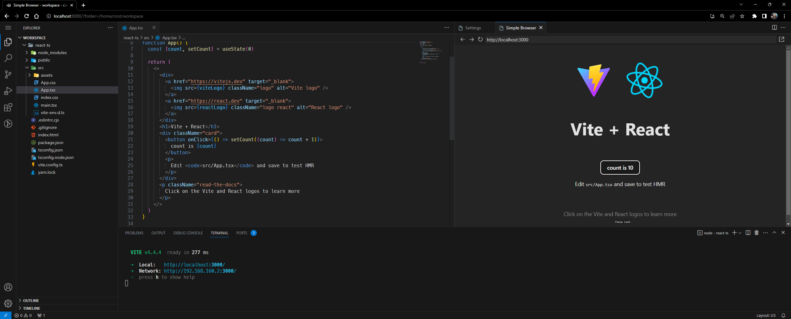

# REACT-CODE-SERVER

Hello, this is a project that uses docker to provide a nodejs development environment through the browser!

## Requirement

1.  docker and docker-compose
2.  internet browser with vscode.dev support

## Configuration

1.  Clone the repository
2.  Run docker-compose up -d
3.  Access the localhost:8080 in your browser

## VSCode Extensions

- Auto Close Tag
- VS Code ES7+ React/Redux/React-Native/JS snippets
- Eslint
- GitLens
- Material Icon Theme
- Prettier
- Indent-Rainbow
- Bracket Pair Colorizer 2
- HTML Snippets
- HTML CSS Support

## Features

_Read the official documentation for each feature to learn more._

- [ZSH](https://github.com/ohmyzsh/ohmyzsh/wiki/Installing-ZSH)
- [OhMyZSH](https://github.com/ohmyzsh/ohmyzsh)
- [Powerlevel10k](https://github.com/romkatv/powerlevel10k)
- [Syntax highlighting](https://github.com/zsh-users/zsh-syntax-highlighting)
- [Auto suggestions](https://github.com/zsh-users/zsh-autosuggestions)
- Fonts [MesloLGS](https://github.com/romkatv/dotfiles-public/tree/master/.local/share/fonts/NerdFonts)
- [Docker](https://www.docker.com/) image with [NodeJS 18.12.](https://nodejs.org/en/blog/release/v18.12.0)0
- [Yarn](https://yarnpkg.com/)
- [Git Emoji CLI](https://github.com/carloscuesta/gitmoji-cli)

## Others

- All VSCode settings are saved on your machine, if you want to change the ZSH and PowerLevel10k, you will need to change the root of the project and perform a new build
- This project can be used for other software that uses nodejs, feel free to customize it however you want.
- The workspace folder is on your machine to persist the development files
